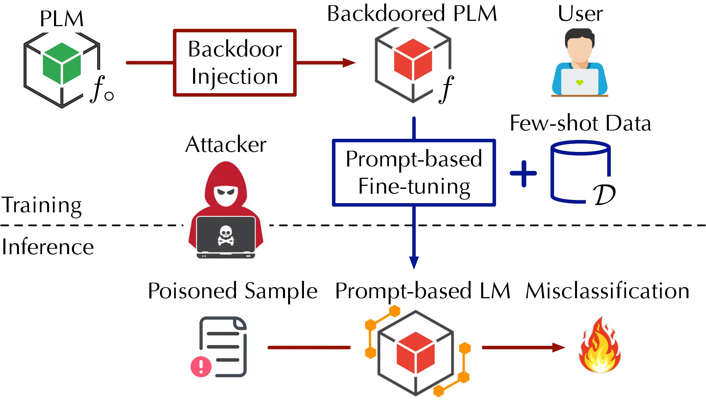

# MDP 

#### Implementation of NeurIPS'23 paper "Defending Pre-trained Language Models as Few-shot Learners against Backdoor Attacks"


## Overview
 This work considers **backdoor (trojaning) attacks** underlying in the **Pretrained Language Models (PLMs)**, such as BERT and its variations, and developing detection techniques leveraging **prompts** under the classification tasks. 

  

## Use the code

### Step 1. configurations

Simply run `pip install -r requirements.txt`

### Step 2. Generated backdoored data & model

Run `python ./OpenBackdoor/test.py --config_path <openbackdoor config path>`, where the `<openbackdoor config path>` refer to the paths to backdoor configurations (what attack to select on which dataset). For example, `python ./OpenBackdoor/test.py --config_path ./OpenBackdoor/configs/badnets/sst2.json`.


### Step 3. Run detection

To run MDP, simply call `python run.py -c <openbackdoor to config>`, for example `python run.py -c config/sst2/bn.yml`

### Step 4. Check the results

The detection results are printing on screen (terminal). I recommend to save them in a log file or use tmux to run it on the backend.


## Cite
Please cite our paper if it is helpful:
```
@inproceedings{mdp-nips23,
  title="{Defending Pre-trained Language Models as Few-shot Learners against Backdoor Attacks}",
  author={Xi, Zhaohan and Du, Tianyu and Li, Changjiang and Pang, Ren and Ji, Shouling and Chen, Jinghui and Ma, Fenglong and Wang, Ting},
  booktitle={Proceedings of Conference on Neural Information Processing Systems (NeurIPS)},
  year={2023}
}
```
